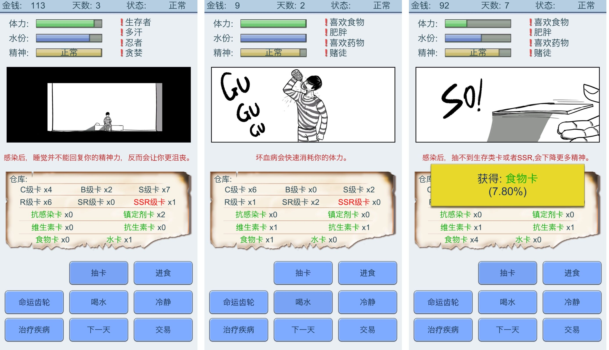
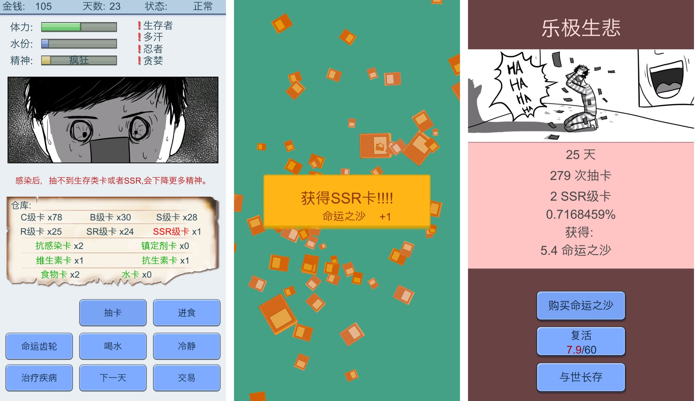
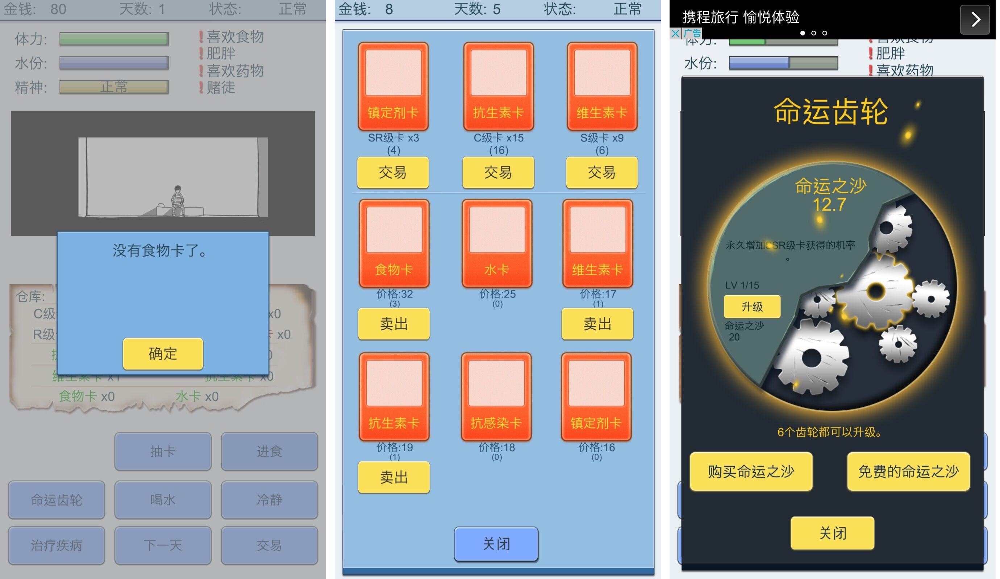

# 当世界只剩下抽卡：抽卡人生

自从抽卡这一游戏元素诞生以来，广大游戏玩家对其又爱又恨。运气好的欧洲人可以一发抽中想要的卡牌，脸黑的非酋只能望洋兴叹、怒删游戏。

一位朋友向我推荐了这款「抽卡人生」，并被告知有毒。我怀着试一试的心态玩了几把，竟然入了迷。

游戏的故事背景是国内游戏业恶劣快速发展，导致游戏类型单一化。就连现实社会也受到了影响，需要花钱抽食物卡才能吃饭，抽水卡才能喝水。游戏的主角被关在监狱中，需要用有限的金钱抽到 100 张最稀有的卡，才能被被无罪释放。但在这之前，玩家首先要考虑怎么才能活下来。

游戏的界面十分简陋，设计却很是精巧。

游戏的一开始，只有 100 的金钱，还有随机分配的四种状态，这四种状态会对主角造成潜移默化的影响。而我们每天需要做的事情就是「抽卡」和「活下来」。

尽管最终的游戏目标是「抽到 100 张 SSR 卡」，但是主角的体力、水分、精神都是会下降的。体力和水分需要靠抽卡抽出的「食物卡」和「水卡」来补充。而精神的变化更复杂一些，如果长期抽不到优质的卡，精神就会不断下降直至疯狂。

于是我开始抽卡，时不时抽到食物卡、水分卡，该吃吃该睡睡。终于在第 12 天的时候抽到了第一张 SSR，但是这时候我的体力和水分都已经非常低了，在第 14 天的时候饿死了。

经历了多次试玩和 Game Over 后。我认真观察了一下，游戏有「交易」系统，可以把自己抽到的普通卡换成自己紧缺的「食物卡」。还有一个「命运齿轮」，可以永久提升自己的能力，让自己可以抽到更多食物和水。

我升级了几次命运齿轮后，确实感觉自己抽到食物卡和水卡的几率变高了。当我想再次升级的时候，发现升级「命运齿轮」需要「命运之沙」。但是「命运之沙」的获取渠道很少，每次抽到 SSR 时会奖励 1 点，在游戏中每过一天会奖励 0.1 点。其他途径就是「花钱购买」和「观看广告」。

好像有那里不对？

刚刚开始游戏的我，会饶有兴致地看剧情字幕，研究游戏的玩法，想方设法让主角活下来，为一张食物卡感到欣喜，为主角的死亡感到难过。

而在多次试玩这个游戏之后，我整个人都在沉迷于疯狂抽卡。为了收集更多的「命运之沙」，直接连续点击十几下抽卡，抽完卡睡觉，第二天接着抽卡、吃饭、喝水……

这时我才恍然大悟，游戏本身是一个设计精巧的游戏，同时也是一个寓言故事。在暗示如今国内游戏大厂不思进取的同时，本身也在利用这个抽卡游戏获取收益。而沉迷于抽卡的，不仅是游戏中的主角，也是屏幕前的你。

>「当你凝视深渊时,深渊也在凝视着你」——尼采

整个游戏形成了一个绝佳的讽刺。

如果你也想体验一下「抽卡人生」，可以在 App Store 中免费下载。
