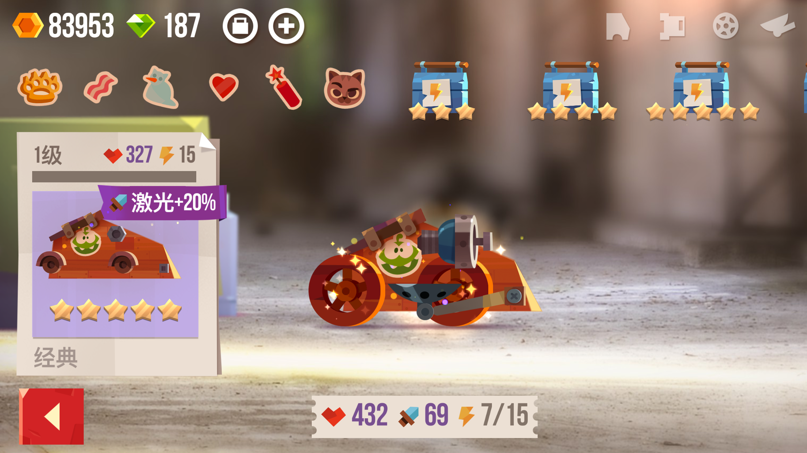

# C.A.T.S : 圆你儿时的机器人战车梦 | App+1

相信有不少人看过机器人对战的电视节目，无论是英国的《Robot Wars》还是美国的《Battlebots》，其中的战车都给观众留下了深刻的印象。但是这种级别的比赛还是留给头脑发达的工程师吧。最近发现了一款有趣的战车游戏：C.A.T.S。

C.A.T.S 是出自 Zeptolab 公司的一个很有意思的联网游戏，玩了一段时间感觉满足了自己儿时组装玩具车的愿望。自动战斗的游戏模式，没有装备碾压，节奏极快上手即玩，很适合打发碎片时间。

##创造力与零部件结合，自由组装战车

C.A.T.S 的核心玩法，是利用手头的各种零部件，制造出各式各样的战车，将敌人击败。

游戏的自由度极高，可以像儿时搭积木一般将零部件组装成战车。零部件分为车身、武器、车轮、辅助部件四个部分。

每个种类的部件都颇具特色，「泰坦」车身像一堵墙，适合进攻，但是一旦被铲翻在地就别想起来了。「火箭」武器虽然伤害高，但是攻击间隔较长。小巧的「滑板轮」和巨大的「大脚轮」需要分别配合合适的车身才能发挥最大的威力。物品之间还会有相互 Buff，比如用一个高生命值的车身再配合 2 个「+100% 生命」的车轮，生命值可以叠到原属性的两倍以上；利用带有「＋20％电锯加成」的车身配合高伤害的电锯，可以打出成吨的伤害。

不过除了优质的零部件， C.A.T.S 更注重战车的结构。如果只用最高品质的零部件，尽管战车的属性值很高，但是有时会无法正常运作。这时候就要考虑战车的结构问题了。由于车身上的「武器孔」和「车轮孔」都是随机的，在开孔位置较高的车身上安装小轮子，那么战车就会完全动不了；如果在轻小的车身上加上推进器，那么稳定性就会很差，非常容易翻车。
所以在战车结构、实用性面前，再高的属性值也只能靠边站。这也一定程度上避免了装备碾压、等级碾压的情况出现。

[图]（小战车被铲翻在地）

##20 秒一局对战，超快速的游戏节奏

制造出了属于自己的战车，就可以开始战斗了。C.A.T.S 的游戏模式是自动战斗，每一局的时间只有 20 秒左右，当对战超过了 10 秒，地图范围就会被慢慢缩小，直到一方的战车爆炸。

在这场自动战斗的过程中，可以亲眼看到自己制造的战车将对手戳烂，也可能会看到战车不敌对手败下阵来。这就更激发了改进战车的欲望。相比需要自己操作的游戏，自动战斗更省心，也不存在操作这一说；相比耗时较长又千篇一律的国产手游，短短 10 秒中可以体验到更爽快更刺激更富有变化的战斗。

如果玩累了，C.A.T.S 还提供了下注模式。下注前能看到两辆战车的对阵图和攻击力、生命值，但是结果还要等待比赛结束后才能看到。奖励一般是给一件物品加上 1%-6% 的特殊效果。

有时候生命值和攻击力都很高的战车也会被灵活的小车打败，这进一步增加了游戏的不可预料性，更考验战车的结构和平衡性。

整个游戏的魅力就在于谁的战车结构更合理，搭配更巧妙。能够在对战中赢得更多的对手。关于这款游戏更多的乐趣，还有待进一步的发掘。

你可以在 [App Store] 中，免费下载 C.A.T.S。
