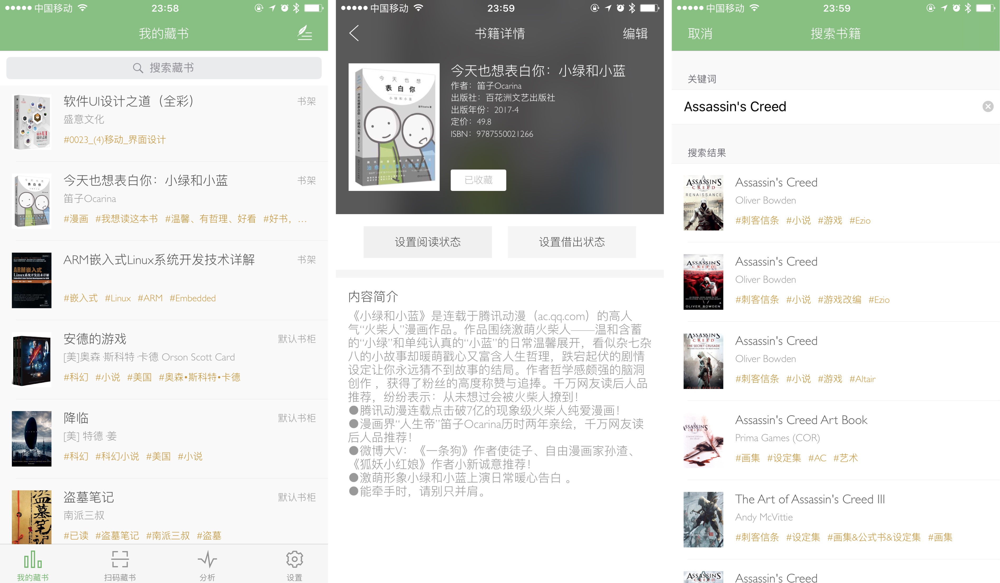
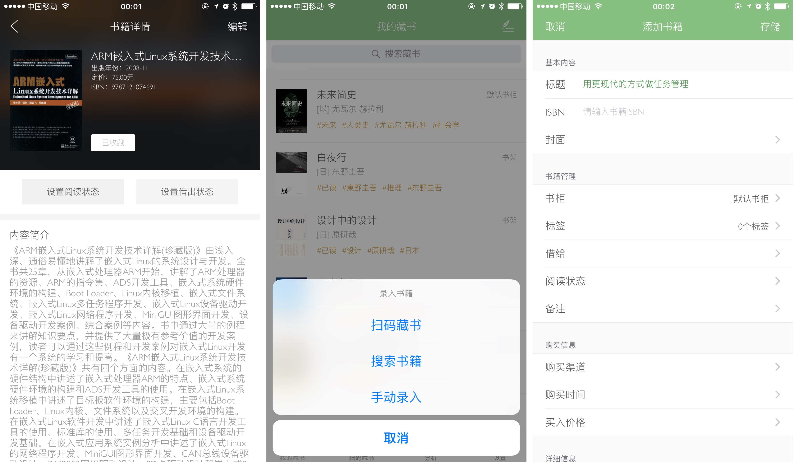
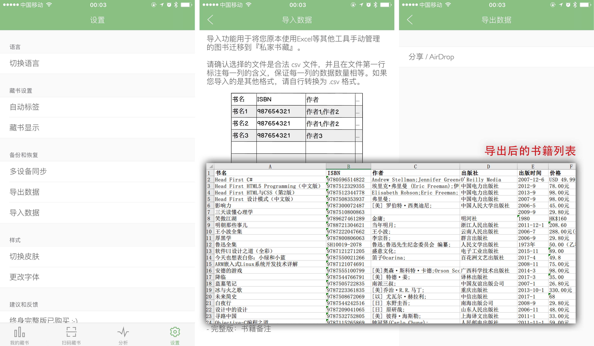

# 给你的藏书找一个管家，属于你的「私家书藏」 | App+1

@([C09] 少数派首页已发布)

对于喜爱阅读的人而言，书籍的收集、阅读、收藏过程都是一种享受。电子书大多可以通过 Kindle、阅读 App 来收集整理。但是对于实体书，显然就没有那么方便了。

当手头有大量实体书籍时，每一次整理都不容易。不仅书目繁多，种类也不尽相同。时不时还会有朋友借走几本。更有不少书买来，只翻过几页就再也没动过。想要从头整理似乎是一件十分困难的事情。我希望能在手机上直观的看到自己阅读过的书籍，进一步分析我的阅读进度，偶尔借出也能看到那些书的去向。所幸我找到了「私家书藏」。

「私家书藏」是一款图书管理应用，便于管理自己的书架、书柜。

第一次使用时需要录入书籍。私家书藏提供了「扫码藏书」、「搜索书籍」、「手动录入」三种方法，供我们录入所有的藏书。通过扫描书籍背部的条形码可以找到该书籍的信息。从书名、作者、出版社，详细到出版年份、书籍价格、内容简介。信息非常全面，还贴心的为书籍贴上了相应的标签，便于在大量书籍中检索信息。如果没有条形码，同样可以搜索书名直接添加书籍，也省去了一本一本扫码的麻烦。

私家书藏的数据库中已经有了大量书籍的信息，我从《盗墓笔记第一卷》一直搜索到《ARM嵌入式Linux系统开发详解》，基本都可以顺利识别。而且英文书籍也有收录（我购买的英文书籍较少，就没有做测试了）。

如果有一些书籍没有被录入，比如学校的教材、冷门书籍，还可以自己为其添加详细的信息。

除了收集藏书的成就感，私家书藏还提供了「分析」和「导出」的功能。可以按作者、出版社、常用的标签进行分类整理。也可以创建多个书架，例如「书房书架」「卧室书桌」「厕所读物（划掉）」等位置，对书籍进行分类。

在设置中其貌不扬的「导出数据」选项，更是为用户提供了导出为 Excel 表格的服务，表格的信息非常全面，便于深度用户进一步的分析和处理。

同时还支持信息的批量导入（进行字段映射，它提供了相应的 .csv 格式），便于已经拥有大量藏书的用户导入书籍信息。

购买了18元的「终身完整版」内购之后，还有 iCloud 同步、借还管理、阅读管理等功能。在特定的功能上提供更高级的服务。

除了标注基本的「已读未读」、「是否借出」之外。完整版还可以添加新的「借阅人」，便于藏书很多、朋友很多的用户更好地管理借出去的书籍。iCloud 同步也为藏书列表增添了一份保障。

如果你也有许多书籍需要整理，不妨在 [App Store](https://appsto.re/cn/ssCxdb.i) 中免费下载 「私家书藏」。
