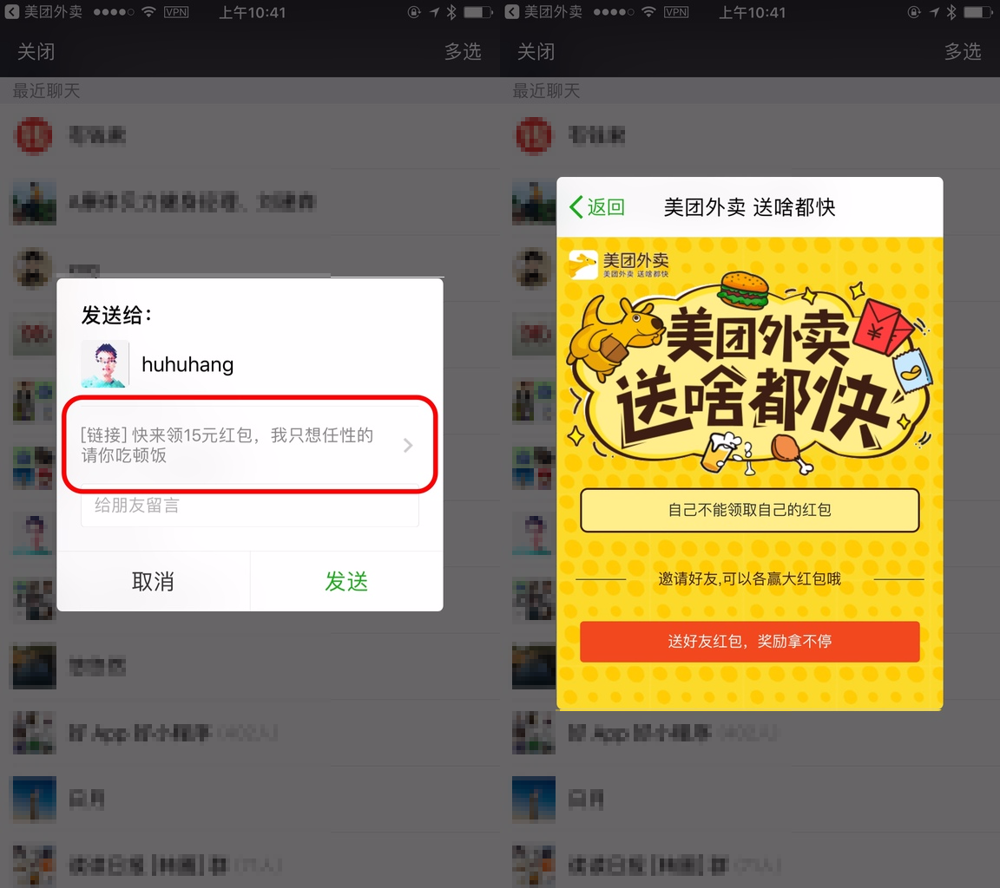

# 微信小技巧：无需分享即可领取优惠红包 | 一日一技

@([C09] 少数派首页已发布)

每点一单外卖，我们就会得到一些平台奖励的红包优惠券。但是这些红包常常需要「分享给微信好友或朋友圈」才能领取。而这种分享消息在没有提前交流的情况下，通常是很突兀且尴尬的。

为了避免这种尴尬，我们通常采用发送给「文件传输助手」或是自己的另一个账号，然后再点开这个链接继续操作。但是在发送之前仔细看一下这个对话框，除了「取消」和「发送」，是不是还有其他的入口？

是的，你无需分享，可以直接点击这个链接，窗口中会直接打开页面，并可以成功领取对应的「红包」、「优惠券」等奖励。

除了红包和优惠券，其他的页面也都可以在这个页面点开链接。再也不用头疼分享给谁了。
