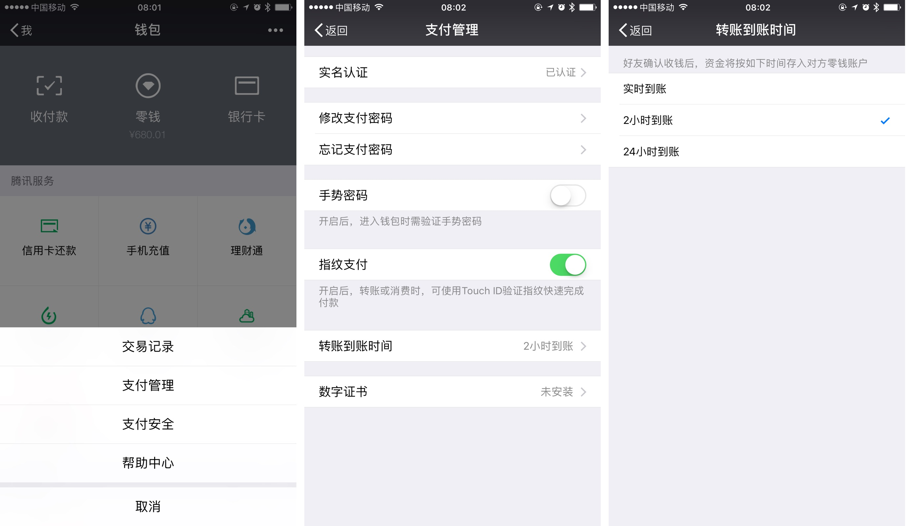

#为微信转账设置到账时间 | 一日一技

我们几乎每天都会用到微信、支付宝进行支付转账等操作。每当需要给一位陌生人转账时，我的脑海里经常会浮现出各种谨防诈骗的新闻，还会担心「会不会转错了」。更何况默认都是实时到账，一旦把钱转出去，再想要回来就难了。

其实微信提供了一项实用的功能，可以让转账「2 小时到账」。

在微信「我」界面中选择「钱包」，点击右上角的「…」，转到「支付管理」，即可设置「转账到账时间」。可以设置为「2 小时到账」或者「24 小时到账」。

当你发现转错了人，或者转账金额出错。你还有至少 2 小时的时间联系对方，或者及时联系微信的客服处理退款。
