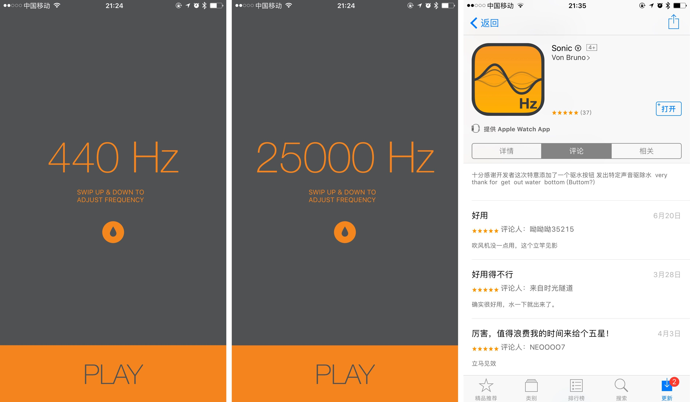

# iPhone 听筒进水了？用 Sonic 把水「震」出来 | App + 1

@([C09] 少数派首页已发布)

尽管 iPhone 7 新增了防水功能，但是听筒依然是最脆弱的一环。一旦把水溅到手机听筒中，听筒会变得沙哑有杂音。网上流传的「吹风机」、「大米」、「棉签」等方法通常是没有用的。

还记得当初 Apple Watch Series 2 发布时介绍的防水功能吗？从水中拿出 Apple Watch 的时候会播放高频率的音频，将手表扬声器中的水排出，以保证声音正常。

这款 Sonic 为 iPhone 提供了类似的功能。

在手机听筒进水后，打开 Sonic，把声音频率调整为 145-165 Hz 之间，就可以看到小水珠从听筒里被「震」出来了。

同时作者还贴心地提供了一个「排水按钮」，长按这个按钮，也可以把水排出来。

这是一款有着特定功能的实用 App，你可以在 [App Store](https://appsto.re/cn/xXg16.i) 中免费下载 Sonic。
