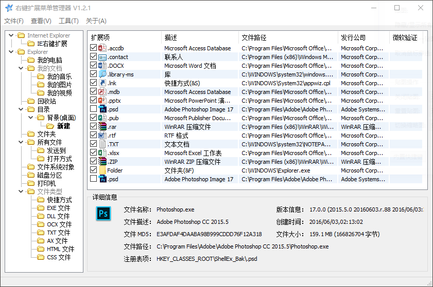

# 解决 Windows 10 下右键无法新建文件的方法

「 Windows 10 中右键无法新建文件」，这两天被这个问题搞的非常头疼，还是 Windows 10 中新出现的问题，网上相关的解决方法很少。

这个症状具体表现为，右键 → 新建，然后卡住，文件资源管理器崩溃。

在我准备重装系统之前，我找到了解决方法。

## 直接上干货，问题的解决方法

1、下载安装 RightMenuMgr 这个右键菜单管理软件。

2、在「Explorer」→「目录」→「背景(桌面)」→「新建」中，依次取消勾选可能导致问题的「扩展项」。

比如我的问题出在了新建「.bmp」「.psd」文件上，取消勾选它们即可解决问题。

由于 Windows 10 更新频繁，发生的问题千奇百怪，这个方法并不能保证 100 % 解决问题。如果无效请试试看其他的方法，可能问题并不是出在这里。

* 如果你对我解决这个问题的具体步骤感兴趣，可以在 Matrix 看看这一篇 [解决 Windows 右键无法新建文件问题的思路和方法](https://sspai.com/post/40217)，参考详细步骤，可能对解决其他问题也有帮助。
