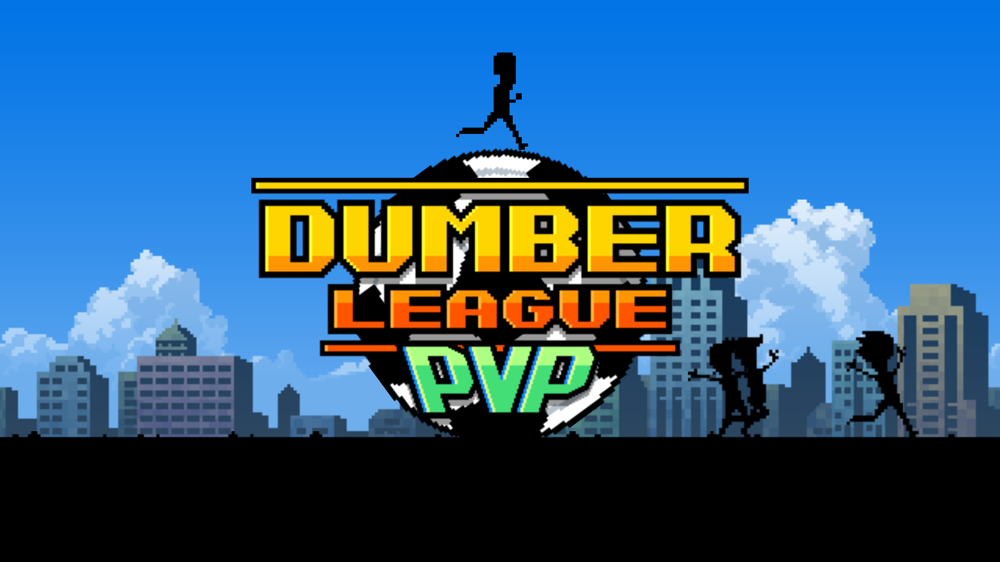
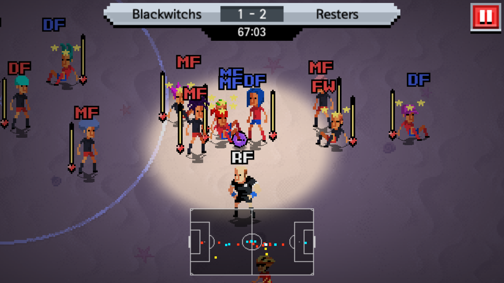

# 炎炎夏日，来一场癫狂魔性的指尖足球吧：Dumber League | App + 1

一个很有意思的足球游戏，通过别样的操作方式和喜感的游戏规则，与其他注重竞技性的同类相比，多了几分戏谑。

游戏的操作方式就像愤怒的小鸟一样，拖动人物就可以把球踢出去。

【视频】

大部分规则与现实中的足球类似，也可以选择球队，分配球员位置，不同的球员也会有体力值。简直是像素风版的 FIFA。

有意思的是，在这个游戏中，你的球员们是不会控球的。一旦拿到球，立刻需要把球踢出去。踢到对手身上还会被弹开，同时把他们击晕。击晕后他们还会在原地休息一会儿。如果有人来抢球，可能还会引发一场大规模的碰瓷。

这幅场景让我不禁想起了当年红白机上的「热血足球」。

玩家还可以通过在比赛中获胜赢得金币，去购买更优质的球队。球队的素质有高有低，有一次我拿着 PW（力量值）较高的球队，被 SPD（速度值）较高的球队放了风筝。最后我连续用球踢他们的守门员，让对方守门员奄奄一息，居然还赢下了这场比赛。（快住手，这根本不是足球！）

游戏中也充满了黑色幽默，在游戏中你可以看到头上插了箭的球员，在球场里穿行的自行车，还有乱入撞人的橄榄球运动员。甚至有时上半场踢的还是足球，下半场就变成了沉重的保龄球……球员的的脚真的不会痛吗？！

这些变数更是增加了游戏的不确定性和趣味性。

尽管这个游戏支持 PVP，不过由于玩家太少几乎匹配不到对手……但你不用担心无法进行游戏，它有着完善的 AI，把它当成一个单机游戏来玩也是很有意思的，存档支持 iCloud 备份。

如果你对 Dumber League PVP 感兴趣，可以在 [App Store](https://appsto.re/cn/Tj-8fb.i) 中下载。
