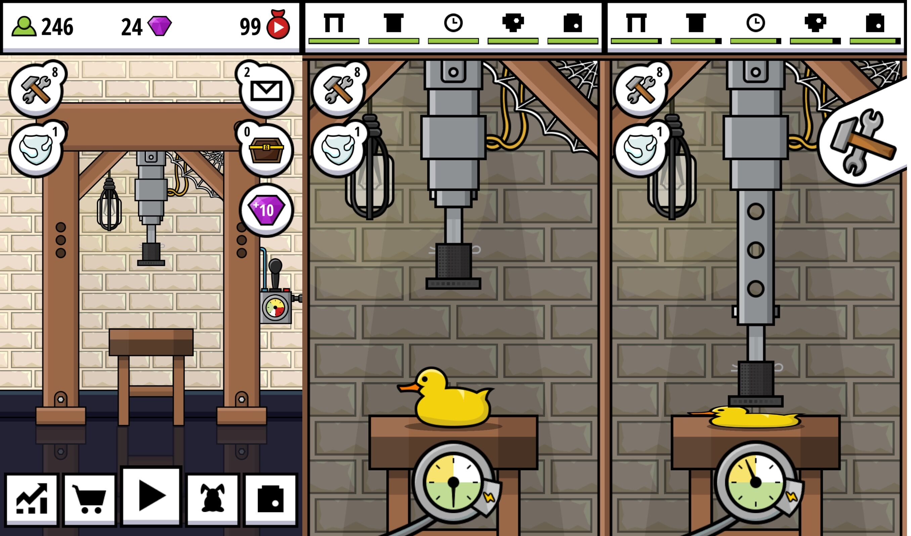

# 让我们一起化身「液压机狂魔」：Hydraulic Press Pocket | App + 1

最近在许多视频网站上，流行着关于液压机压各种东西的视频。

这类视频的共同特点是用液压机压扁一些物品，比如水果、橡皮泥、闹钟，甚至是诺基亚、YouTube 奖杯……然后录下来发到各种视频网站上。比如 [YouTube 液压机频道](https://www.youtube.com/channel/UCcMDMoNu66_1Hwi5-MeiQgw)、[Bilibili 液压机](https://search.bilibili.com/all?keyword=%E6%B6%B2%E5%8E%8B%E6%9C%BA)。

出自 [YouTube](https://www.youtube.com/watch?v=tpielBiLyfQ)

这一类视频的目的性不强，大多是图个乐子。尽管经常有弹幕刷「意义何在」，拍摄视频也有浪费之嫌。但是它吸引的观众数量却一直居高不下。那有没有什么办法，既不浪费，也能体会到液压机快感呢？

Hydraulic Press Pocket！

在这款游戏中，我们需要扮演液压机视频制作者。利用液压机不断地压各种物品，在压的过程中可以收取礼物，然后上传视频，获得关注度。再通过获得的打赏来不断升级液压机。

可不要觉得这是一件很容易的事情。游戏的流程看似简单，其实有许多有意思的小细节。

在选择压什么物品的时候，你需要根据观众的口味选择，还要尽量选择没有试过的物品，否则观众会不高兴，甚至向你扔炸弹——如果你点到了炸弹还会炸掉液压机……

在压东西的过程中，你需要参考液压机旁边的表盘，如果在压轻小物品时一味地加大马力，很可能会损坏你的液压机。另外你还要考虑节目效果，尽量延长播放时间，以便接收更多的礼物。

在每一次压完东西之后，液压机的零部件都有可能出现损耗，你需要敲敲打打来维修它们。

上传到视频网站后，你的粉丝会增加，视频会有点赞的人也会有反对的人。你还会收到粉丝们寄来的物品，然后转眼就把他们放进液压机。

最后赚到了钱，你可以购置更高级的摄像机，升级你的液压机。当你的粉丝达到了一定数量，你还可以卖相关周边，赚更多的钱。

游戏有意思的地方还不止这些。不同被压的东西会有不同的效果。

魔方被压时，上面的小方块会一个接一个蹦出去。台灯被压时，灯罩会被先压下去，接着灯泡被瞬间压碎，然后整个被压扁。西瓜被压时，红色的汁水不断飞溅，最后西瓜炸裂。

如果是压保龄球这种高难度物品，你的液压机还会与它同归于尽——大幅度降低耐久。但是观众喜欢，我们又能怎么办呢？

这款游戏采用了轻松有趣的画风，向我们展示了成为一个液压机视频大佬的艰难道路。可以在游戏中体会到粉丝数量增加的快乐，也会感受到被人反对（扔炸弹）的痛苦。而且在很多细节上都做的很不错，看到液压机压爆物品的瞬间，真的是非常过瘾，是一个值得一玩的休闲小游戏。

如果你也想体验一把液压狂魔的视频之路，可以在 [App Store](https://appsto.re/cn/Pxd-ib.i) 和 [Google Play](https://play.google.com/store/apps/details?id=fi.LinnamaEntertainment.hydraulicpress) 中免费下载试玩。
