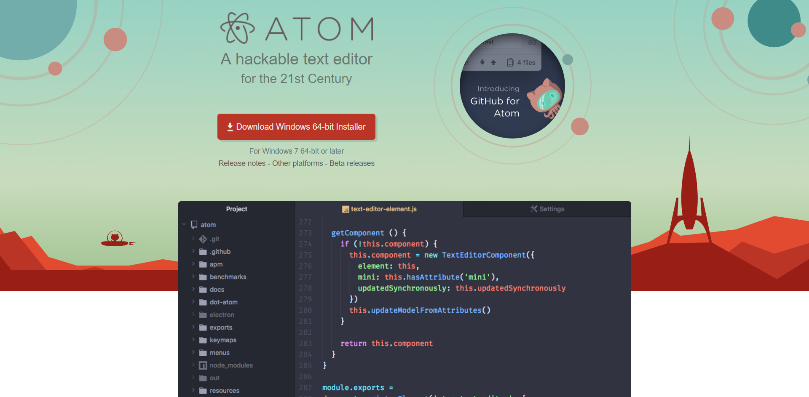
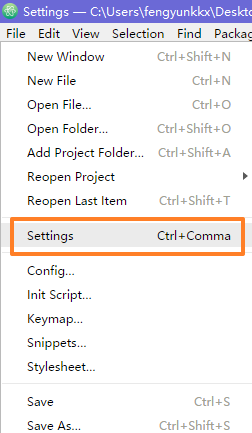
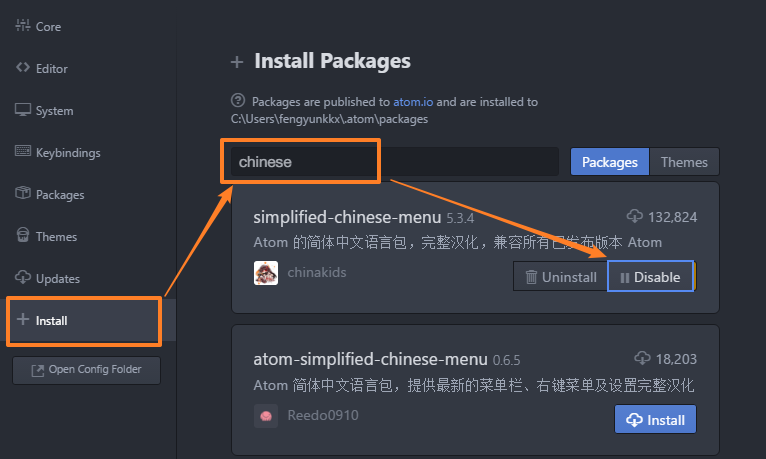

# 利用 Atom 为自己打造一个专属 Markdown 编辑器 | 一日一技

技巧难度：★★★★☆

我一直在 Windows 上寻找一款足够媲美 MWeb 和 Ulysses 的 Markdown 编辑器，于是我盯上了这款本为程序员设计的 Atom 编辑器。

我在对 Atom 有想法之前，使用的 Markdown 编辑器是马克飞象。马克飞象不仅可以与 Evernote 进行同步，而且在图片插入方面也有着不小的优势。之前我还尝试过 typora，可惜不太习惯它的「所见即所得」，更喜欢分屏的「编辑 + 预览」形式。

一次偶然的机会，我发现 Atom 的 Markdown 方面的插件已经非常成熟，安装也相对简单。再加上 Atom 本身的灵活性很强，非常适合定制出一款适合自己的 Markdown 编辑器。

## 论 Markdown 编辑器的基本素养

我认为一个优秀的 Markdown 编辑器应该具备的功能有以下这些：

- 足够方便的编辑功能，有全面的快捷键
- 支持导出 HTML、PDF 格式的文件
- 方便快捷地插入图片、链接等
- 支持 LaTeX 公式、表格

还有一些加分项：

- 美观的高亮着色
- 能够接入各种云服务
- 可以自定义 CSS 样式
- 美观的界面、丰富的主题、自定义字体

通过 Atom 改造的 Markdown 编辑器，已经满足了大部分条件。

那就让我们开始改造吧。

## 第一步：下载并安装 Atom

我们需要在 [Atom 的官网](https://atom.io/) 下载 Atom（支持 Windows、macOS、Linux、FreeBSD 系统），并完成安装。

## 第二步：安装中文补丁

中文环境有助于我们更快地适应 Atom 编辑器。这一步不是必需的，如果你更喜欢英文环境就跳过这一步吧。

在 File 中找到 Settings，进入设置页面。

点最下面的 Install，搜索 Chinese，找到「simplified-chinese-menu」，然后点击 Install 即可。

- 如果你的网络环境较差，可以在该插件的 [Github 页面](https://github.com/chinakids/atom-simplified-chinese-menu) 下载中文补丁。

## 第三步：下载并安装 Markdown 增强插件

经过比较，我选择了这款 [Markdown-preview-enhanced](https://atom.io/packages/markdown-preview-enhanced) 插件，它提供了 Markdown 相关的大部分功能，覆盖非常全面。

安装方式与中文补丁类似。在插件安装界面搜索「markdown-preview-enhanced」，点击安装即可。

@import "03-下载安装增强插件.png"

- 如果你的网络环境较差，可以在该插件的 [Github 页面](https://github.com/shd101wyy/markdown-preview-enhanced)  下载 Markdown-preview-enhanceed。

## 第四步：简单学习一下这个全新的编辑器

Atom 本身就是一个优秀的编辑器，自带了自定义字体、自定义快捷键等功能，同时还有大量主题、大量插件可以使用，对 Github 的支持更是远超其他的编辑器。

而且 Atom 自带了完善的 Markdown 语法支持，在 Markdown-preview-enhanceed 这款插件的加持下，更是如虎添翼。既然是第一次使用，还是需要简单学习并了解一下这个编辑器的。

### 基础性功能的改进

这款插件在编辑方面的改进：

- 自动高亮 Markdown 语法
- 支持预览滑动同步
- 支持 LaTeX
- 可以利用代码渲染 TikZ、Chemfig 等图形

这是 Markdown 编辑器在编辑方面的基础性功能，最大的亮点是通过代码生成流程图、时序图等。

我利用简单的几行代码，就生成了一个流程图。

@import "05-代码生成图片.png"

### 对导入导出功能的改进

在导入导出方面的改进：

- 支持导入外部文件
- 支持导出 PNG、JPEG 格式的文件（需要额外安装 phantomjs）
- 支持导出 HTML 文件（移动端支持）

在导入图片的时候，按下 Ctrl + Shift + I，会出现图片导入助手。支持链接、拖拽导入、上传图片到图床等功能。（图床限定为 imgur.com 和 sm.ms 这两个）

Markdown 中导入图片原本的语法是 ``。

在这个插件中不仅可以用这个语法，还增加了 `@import "图片.png"` 语法。`@import "表格.csv"`导入表格文件将会被转换成 Markdown 表格。`@import` 还支持其他的一些格式，比如 PDF 和 HTML，这些就需要自己摸索了。

@import "06-项目文件夹.png"

再加上 Atom 自带的「项目文件夹」功能，可以对应本地文件夹实现分类树管理文档，与 MWeb 的文档库模式相差无几。

这些改进满足了我对 Markdown 编辑器的绝大部分要求。到这里，一个由 Atom 改造的 Markdown 编辑器就已经完成了。

Enjoy it！

## 进阶：定制更高级的功能

如果折腾了半天，仅仅做到这样，似乎有点得不偿失，毕竟还有不少 Markdown 编辑器的体验优于 Atom。

那么接下来才是真正的「打造自己专属的 Markdown 编辑器」了。这些进阶设置，可以让我们定制化 Atom，使其更适应我们的需求。

除了这些上面介绍的常用功能，Markdown-preview-enhanced 插件还提供了一些更高级的功能：

- 支持编译到 GitHub Flavored Markdown
- 可以自定义预览 CSS（让你导出的 HTML 更美观）
- 支持导出 ePub、Mobi、PDF 的电子书文件
- 支持 TOC 生成
- 可以通过代码绘制流程图、时序图以及各种其他种类的图形

我们只需要通过简单的设置，可以做到自动化。比如——

### 设置「保存文件时自动导出 HTML 格式」

我们在

@import "07-右键浏览.png"

- 如果你想了解关于这个插件的具体教程和更多信息，可以在 [插件介绍页面](https://shd101wyy.github.io/markdown-preview-enhanced/#/zh-cn/) 查看。

## 更多的 Markdown 相关个性化插件

Markdown-preview-plus 实时预览增强插件
https://github.com/atom-community/markdown-preview-plus

Markdown-scroll-sync 同步滚动插件
https://atom.io/packages/markdown-scroll-sync

Language-markdown 代码增强插件
https://atom.io/packages/language-markdown

markdown-writer：方便管理图片、链接等
https://atom.io/packages/markdown-writer

Markdown-table-editor 表格编辑插件
https://atom.io/packages/markdown-table-editor

Markdown-themeable-pdf、pdf-view PDF导出插件
https://atom.io/packages/markdown-themeable-pdf

markdown-img-paste 图片粘贴插件
https://atom.io/packages/markdown-img-paste

atom-shortcuts Atom快捷键
https://atom.io/packages/atom-shortcuts

字数统计插件

### 设置

安装完之后，我们需要安装 Markdown 的增强插件 Markdown-preview-plus，此插件由 Atom-Community 团队开发，在 Atom 自带的 Markdown-preview 插件的基础上进行了改进，新增了对「实时预览 Markdown」和「LaTeX 公式」的支持。

但是在使用这款插件之前，需要先禁用自带的 Markdown-preview 插件，否则会发生快捷键冲突等情况。

## 总结

利用 Atom 为自己打造 Markdown 编辑器

注：如果 Atom 中的插件安装功能无法下载或者非常慢，你可能需要科学上网，或者看看我的另一篇文章 [在 Windows 下手动安装 Atom 插件的简单方法]()。
