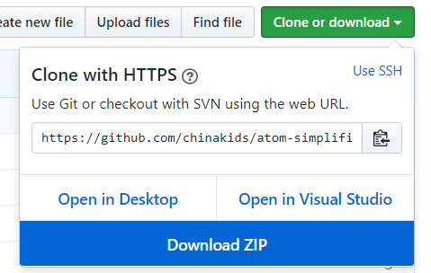

# 在 Windows 下手动安装 Atom 插件的简单方法

Atom 是一款优秀的编辑器，它的可拓展性和丰富的插件是一大亮点，号称「21 世纪的可编程编辑器」。但是由于众所周知的原因，我们有时候无法通过 Atom 内置的扩展功能直接下载。所以我们需要学会手动安装 Atom 插件。

## 查找插件

首先在 [Atom Packages 页面](https://atom.io/packages) 查找想要的插件。

比如这款人气很高的美化插件：[activate-power-mode](https://atom.io/packages/activate-power-mode)。

打开通常是该插件的介绍页面，点击 install 会跳转到 Github 页面。

## 下载插件

在 Github 上下载插件的方法是点击右上角的「Clone or download」然后点击「Download ZIP」。

 

下载完毕后，将 zip 压缩包解压。

## 安装插件

把解压后的文件夹，整个复制到目录 「C:\Users\你的电脑用户名\\.atom\packages\」下

（你可以在 Atom 的 File → Settings → install 中看到这个目录的具体位置）

复制到这个目录中之后，按下「Windows 键 + R」，输入 cmd，打开本地命令窗口。

输入 `apm install activate-power-mode`。（如果安装其他插件就换成其他名字。）

稍等一会儿后，会出现 `Installing activate-power-mode to ... done`

重新打开一下 Atom，至此插件手动安装完成。
