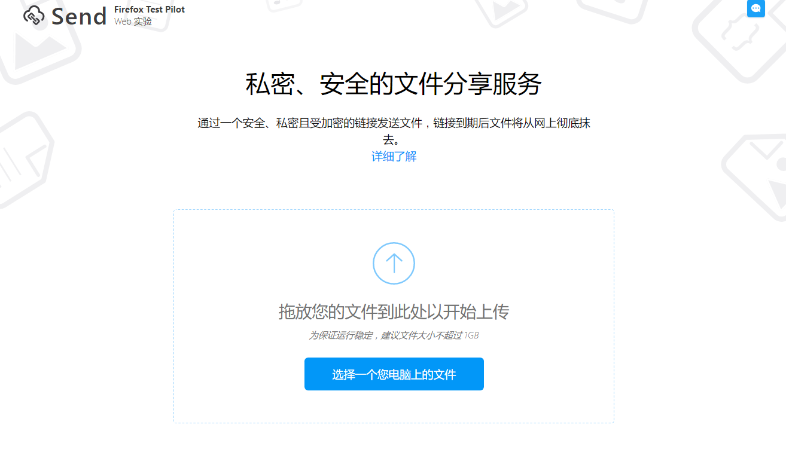

# Firefox Send ：属于文件的阅后即焚服务 | App+1

FireFox Send 提供的是一种类似于阅后即焚的文件分享服务。允许用户上传很大的文件（最大为 1 GB），然后生成一个分享链接。

每个链接只允许 1 次下载，如果在 24 小时内没有任何下载，则文件过期，并会自动从 Send 的服务器中删除。

FireFox Send 是一个由火狐推出的实验性功能，与其他实验性功能不同的是，它是一个 Web 页面。你不需要安装任何插件，就可以用任何浏览器访问它。

如果你对它感兴趣，可以访问 [Firefox Send](https://send.firefox.com) 体验。
